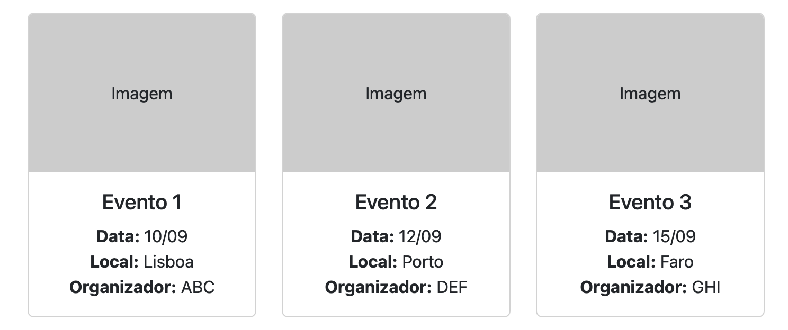

# Eventos Plugin

## Descrição
O **Eventos Plugin** permite gerir e apresentar eventos no WordPress de forma simples e organizada. Inclui Custom Post Type, shortcodes, template single, bloco Gutenberg para listas de eventos e carregamento automático de imagens da pasta `assets`. Funciona com qualquer tema, incluindo temas FSE como Twenty Twenty-Five.

---

## Compatibilidade com Temas

- O plugin funciona com qualquer tema WordPress.
- Para temas clássicos: adicione a página "Todos os Eventos" diretamente ao menu através de `Appearance → Menus`.
- Para temas FSE (Full Site Editing, como Twenty Twenty-Five): pode usar o bloco Gutenberg **"Menu de Eventos"** para inserir a lista de eventos onde desejar.

---

## Funcionalidades

- **Custom Post Type “Eventos”**
  Com suporte a título, conteúdo, imagem de destaque e campos personalizados.

- **Campos ACF** (Advanced Custom Fields)
  - Data do evento
  - Local
  - Organizador

- **Shortcodes**
  - `[eventos_futuros]` → lista apenas os eventos cuja data seja igual ou superior à atual
  - `[eventos_todos]` → lista todos os eventos

- **Template single**
  - `single-eventos.php` → exibe título, data, local, organizador, conteúdo e imagem de destaque

- **Criação automática da página “Todos os Eventos”**
  - Ao ativar o plugin, a página é criada automaticamente e já inclui o shortcode `[eventos_todos]`

- **Seeder de eventos de teste**
  - Gera automaticamente 6 eventos de exemplo no CPT “Eventos”
  - Cada evento recebe:
    - Lorem ipsum como conteúdo
    - Campos ACF preenchidos (data, local, organizador)
    - Imagem de destaque diferente, retirada da pasta `assets/`

- **Bloco Gutenberg “Menu de Eventos”**
  - Permite inserir listas de eventos em qualquer página ou template
  - Compatível com temas FSE

- **Upload automático de imagens**
  - Todas as imagens `.jpg` dentro da pasta `assets/` são carregadas na biblioteca de multimédia ao ativar o plugin

- **Compatibilidade**
  - Funciona com qualquer tema, incluindo FSE
  - Responsivo e com layout baseado em Bootstrap

---

## Como usar

1. **Instalar o plugin**
   - Colocar a pasta `eventos-plugin` em `wp-content/plugins/`

2. **Ativar o plugin**
   - A página “Todos os Eventos” será criada automaticamente
   - O seeder cria **6 eventos de teste** com lorem ipsum e imagem de destaque
   - Todas as imagens `.jpg` na pasta `assets/` são carregadas na biblioteca de multimédia

3. **Adicionar a página ao menu do site**
   - Temas clássicos: `Appearance → Menus → adicionar página`
   - Temas FSE (como Twenty Twenty-Five): `Appearance → Editor → Header → Navigation block → adicionar página`

4. **Inserir shortcodes**
   - `[eventos_todos]` → lista todos os eventos
     - Exemplo com limite de 6 eventos:
       ```[eventos_todos limite="6"]```
   - `[eventos_futuros]` → lista apenas eventos futuros
     - Exemplo com limite de 3 eventos:
       ```[eventos_futuros limite="3"]```

5. **Inserir bloco Gutenberg**
   - Procurar por **“Menu de Eventos”** no editor
   - Configurar atributos como listar apenas futuros, limite de eventos, etc.
   - Inserir em qualquer página ou template

---

## Notas sobre a estrutura

    - assets/: imagens .jpg carregadas automaticamente na biblioteca de multimédia.
    - modulos/: contém toda a lógica do plugin, incluindo CPT, shortcodes, seed, upload de imagens, settings, admin notice e enqueue.
    - blocks/: bloco Gutenberg “Menu de Eventos” compatível com FSE.
    - templates/: template single para os eventos.
    - loader.php: centraliza todos os require_once dos módulos, simplificando o eventos-plugin.php.
    - admin-settings.php: controla checkboxes de limpeza ao desativar e ao eliminar.
    - desativar.php e uninstall.php: executam a limpeza condicionalmente, apenas se as opções estiverem ativadas.

---

## Exemplos visuais

    Abaixo estão exemplos de como os eventos podem ser exibidos:

    - **Todos os Eventos** (grelha de 3 colunas)
    - Cada evento mostra:
    - Imagem de destaque
    - Título
    - Data
    - Local
    - Organizador
    - Conteúdo

## Exemplo de grelha (3 colunas)



---

## Estrutura final do plugin

```text
eventos-plugin/
├── eventos-plugin.php              ← ficheiro principal do plugin
├── uninstall.php                   ← lógica de limpeza ao apagar o plugin
├── readme.md
├── assets/                          ← imagens JPG para upload automático
│   ├── img1.jpg
│   ├── img2.jpg
│   └── img3.jpg
├── blocks/
│   └── eventos-menu-block.php       ← bloco Gutenberg
├── templates/
│   └── single-eventos.php           ← template single do CPT
└── modulos/
    ├── acf-fields.php               ← definição de campos ACF (Pro)
    ├── admin-notice.php             ← aviso no admin após ativação
    ├── admin-settings.php           ← página de configurações (limpeza ao desativar/eliminar)
    ├── carga-imagens.php            ← upload automático de imagens para multimédia
    ├── cpt.php                       ← criação do Custom Post Type “Eventos”
    ├── desativar.php                 ← limpeza ao desativar (usa checkbox de settings)
    ├── enqueue.php                   ← scripts e estilos (Bootstrap, CSS)
    ├── loader.php                    ← require centralizado de módulos
    ├── seed-eventos.php              ← seed de 6 posts de eventos de simulação
    └── shortcode.php                 ← shortcodes [eventos_todos], [eventos_futuros]
